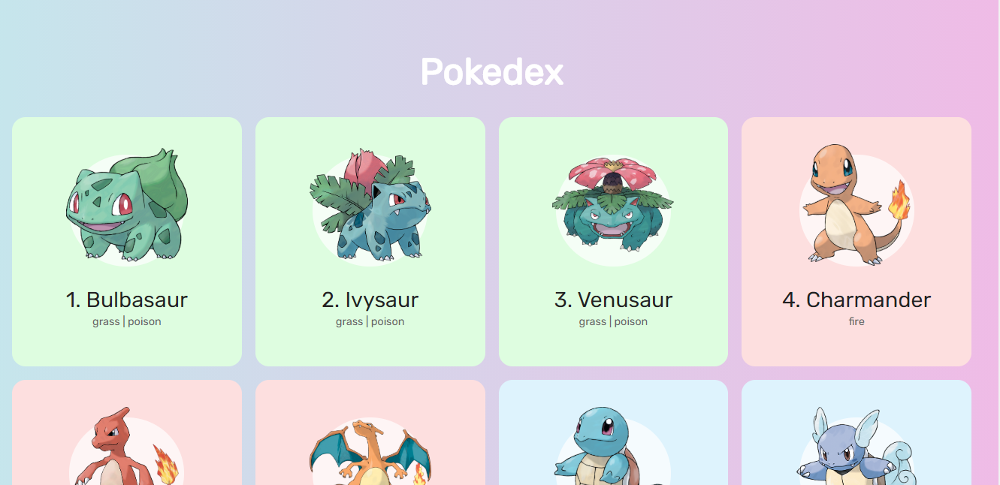

<h1 align="center">  Gotta catch 'em all! </h1>
 
<h2 align="center">Pokedex of first Pokemon Generation with pure Javascript </h2>

 
 

  credits for teatcher Roger Mello! Follow he on YouTube! 
 https://www.youtube.com/c/RogerMelo
 

